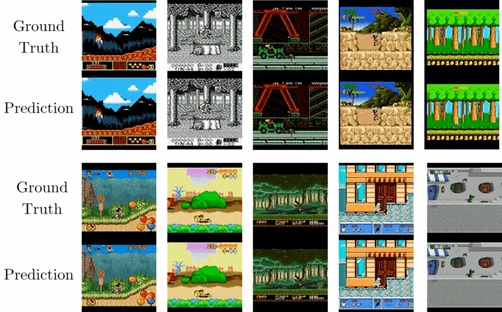
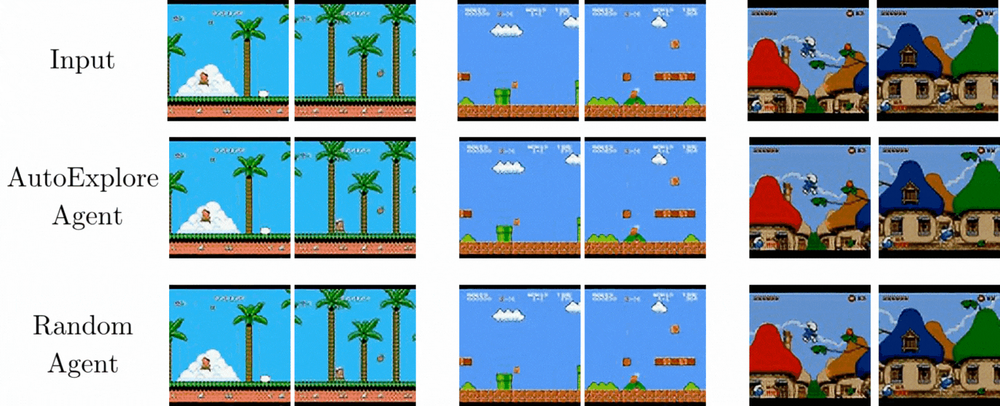

<div align="center">


# GenieRedux

This is the official repository of <b>Exploration-Driven Generative Interactive Environments, CVPR'25</b>.

[](https://insait-institute.github.io/GenieRedux/)
[](https://arxiv.org/pdf/2504.02515v1) 
<!-- [](https://huggingface.co/INSAIT-Institute/GenieRedux)  -->

Authors: [Nedko Savov](https://insait.ai/nedko-savov/), [Naser Kazemi](https://naser-kazemi.github.io/), [Mohammad Mahdi](https://insait.ai/mohammadmahdi-ghahramani-2/), [Danda Pani Paudel](https://insait.ai/dr-danda-paudel/), [Xi Wang](https://xiwang1212.github.io/homepage/), [Luc Van Gool](https://insait.ai/prof-luc-van-gool/)


<!-- 
[](https://nsavov.github.io/GenieRedux/)
[](https://arxiv.org/pdf/2409.06445) 
[](https://huggingface.co/INSAIT-Institute/GenieRedux) 

Authors: [Naser Kazemi](https://naser-kazemi.github.io/)\*, [Nedko Savov](https://insait.ai/nedko-savov/)\*, [Danda Pani Paudel](https://insait.ai/dr-danda-paudel/), [Luc Van Gool](https://insait.ai/prof-luc-van-gool/) -->

<!-- 
Keywords: Genie, Genie world model, Generative Interactive Environments, Genie Implementation, Open Source, RL exploration, world models, virtual environments, data-drive simulator.
This repository contains a Pytorch open-source implementation of the Genie world model (Bruce et. al.) by Google DeepMind, as well as a novel framework for training world models on cheap interaction data from virtual environments. 
-->
<!-- 


 -->
</div>

<div style="width: 100%; max-width: 800px; margin: auto;">
  <!--
    Flex container: two children, each 50% of the wrapper
  -->
  <div style="display: flex; gap: 0.5em;">
    
    
  </div>
</div>

We present a framework for training multi-environment world models spanning hundreds of environments with different visuals and actions. Our training is cost-effective, as we make use of automatic collection from virtual environments instead of hand-curated datasets of human demonstrations. It consists of 3 components:

* <b>RetroAct</b> - a dataset of 974 annotated retro game environments - behavior, camera view, motion axis and controls
* <b> GenieRedux-G </b> - a multi-environment transformer world model, adapted for virtual environments and an enhanced version of GenieRedux - our open version of the Genie world model (Bruce et. al.).
* <b> AutoExplore Agent</b> - an exploration agent that explores environments entirely based on the dynamics prediction uncertainty of GenieRedux, escaping the need for an environment-specific reward and providing diverse training data for our world model.

In our latest work, we demonstrate our method on many platformer environments, obtained from our annotated dataset. We provide the training and evaluation code.

> ⚠️ For a minimal case study with the Coinrun environment (as described [here](https://nsavov.github.io/GenieRedux/)), where both GenieRedux and GenieRedux-G are demonstrated, with pretrained weights and with an option for a trained agent, please refer to the [neurips branch](https://github.com/insait-institute/GenieRedux/tree/neurips).


## Installation
<b>Prerequisites:</b>
- Ensure you have Conda installed on your system. You can download and install Conda from the [official website](https://docs.conda.io/projects/conda/en/latest/user-guide/install/index.html).

1. <b>Clone the repository.</b>
   ```shell
    git clone https://github.com/insait-institute/GenieRedux.git
    cd GenieRedux
   ```

2. <b>Install environments.</b>

   ```shell
   bash install.sh
   ```

   Installs 3 conda environments:
   - `retro_datagen` - data generation environment with support for Stable-Retro.
   - `genie_redux` - environment for training and evaluation of GenieRedux models
   - `auto_explore` - environment for training and evaluation of AutoExplore Agent models.

   In addition, our modified Agent57 repository is set up and our pretrained Agent57 models - downloaded

   > ⚠️ You need to obtain and import the game ROMs in Stable-Retro. To do so, please follow instructions at the [Stable-Retro Docs](https://stable-retro.farama.org/getting_started/#importing-roms).

Note: This implementation is tested on Linux-64 with Python 3.13 and Conda package manager.
## Quickstart

### Initial Data Generation

To generate all initial datasets (saved in `data_generation/datasets/`), run:

```bash
conda activate retro_datagen
python run.py generate config=retro_act/pretrain
python run.py generate config=retro_act/control
python run.py generate config=retro_act/control_test
```

### Training GenieRedux

Before we start, we set up the environment:
```bash
conda activate genie_redux
```

#### Tokenizer
To train the tokenizer for on the generated dataset (for 150k iterations), run:
```bash
python run.py genie_redux train config=tokenizer.yaml train.num_processes=6 train.batch_size=7 train.grad_accum=2
```

#### GenieRedux-G (Dynamics Only) Pretraining
In our paper, we pretrain a model, conditioned on ground truth actions, on 200 platformers:
```bash
python run.py genie_redux train config=genie_redux_guided_pretrain.yaml train.num_processes=7 train.batch_size=4 train.grad_accum=3
tokenizer_fpath=checkpoints/tokenizer/tokenizer/model-150000.pt
```

If you have more resources, we advise pretraining on all platformers by adding the parameter `train.n_envs=0`. To account for more environments, also set a higher value for `train.num_train_steps`.

#### GenieRedux-G-50
Finetuning on 50 control-aligned environments:
```bash
python run.py genie_redux train config=genie_redux_guided_50 train.num_processes=7 train.batch_size=4 train.grad_accum=3 model_fpath=checkpoints/genie_redux_guided/genie_redux_guided_pretrain/model-180000.pt
```

#### (Optional) GenieRedux (Dynamics+LAM)
Having the trained tokanizer, we can now train GenieRedux:
```bash
python run.py genie_redux train config=genie_redux train.num_processes=7 train.batch_size=3 train.grad_accum=4 tokenizer_fpath=checkpoints/tokenizer/tokenizer/model-150000.pt
```

### Evaluating GenieRedux

To get quantitative evaluation (ΔPSNR, FID, PSNR, SSIM):
```bash
python run.py genie_redux eval config=genie_redux_guided_50 eval.action_to_take=-1 eval.model_fpath=checkpoints/genie_redux_guided/genie_redux_guided/model-100000.pt eval.inference_method=one_go 
```

### Training AutoExplore Agent

```bash
conda activate auto_explore
```

Launch AutoExplore training via the unified launcher using the `auto_explore` stack. Lightning Fabric handles device setup internally.

```bash
python run.py auto_explore train common.root_dpath=checkpoints/auto_explore world_model.root_dpath=checkpoints/genie_redux_guided world_model.model_dname=genie_redux_guided world_model.model_fname=model-100000.pt collection.games='["SuperMarioBros-Nes"]'
```

Notes:
- `world_model.*` points the agent to a pretrained Genie/GenieRedux checkpoint (directory name + filename).
- ``collection.games` selects the game. Example games to try: <i>AdventureIslandII-Nes, SuperMarioBros-Nes, Flintstones-Genesis, TinyToonAdventuresBustersHiddenTreasure-Genesis, BronkieTheBronchiasaurus-Snes, BugsBunnyBirthdayBlowout-Nes</i>
- Outputs (checkpoints, configs, media) are written under `common.root_dpath/<run_name>`.


### Evaluating AutoExplore Agent

```bash
conda activate auto_explore
```

Launch evaluation via the unified launcher using the `auto_explore` stack.

```bash
python run.py auto_explore eval world_model.root_dpath=checkpoints/genie_redux_guided world_model.model_dname=genie_redux_guided world_model.model_fname=model-100000.pt common.root_dpath=checkpoints/auto_explore common.resume_id=1 common.resume_ckpt_id=model_best_reward collection.games='["SuperMarioBros-Nes"]'
```

Notes:

- `common.resume_id` specifies which training run to evaluate (matches the numbered model directory).
- `common.resume_ckpt_id` selects the checkpoint file within that run (e.g. `model_best_reward`).
- `collection.games` selects the game (the same as in training should be used)
- Evaluation runs a single very long episode per epoch, computes average return, and generates gifs, stored on wandb and in <run_dir>/outputs/gifs/.


### AutoExplore Data Generation

To generate a dataset with the trained AutoExplore Agent (saved in `data_generation/datasets/`), run:

```bash
conda activate retro_datagen
python run.py generate config=retro_act/auto_explore_ai2 config.connector.agent.checkpoint_fpath=`realpath checkpoints/auto_explore/001_auto_explore/checkpoints/model_best_reward.pt`
```

### Finetuning GenieRedux on AutoExplore Data
First, the tokenizer is finetuned:
```bash
conda activate genie_redux
python run.py genie_redux train config=tokenizer_ft_smb.yaml train.num_processes=6 train.batch_size=7 train.grad_accum=2 tokenizer_fpath=checkpoints/tokenizer/tokenizer/model-150000.pt
```

Then, given the finetuned tokenizer, the dynamics is finetuned
```bash
python run.py genie_redux train config=genie_redux_guided_ft_smb train.num_processes=7 train.batch_size=4 train.grad_accum=3 model_fpath=checkpoints/genie_redux_guided/genie_redux_guided/model-100000.pt tokenizer_fpath=checkpoints/tokenizer/tokenizer_ft_smb/model-150000.pt
```

### Evaluating the finetuned GenieRedux-G with Agent57
First, generate a dataset with our pretrained weights:

```bash
conda activate retro_datagen
python run.py generate config=retro_act/agent57_smb
```

- Note: Also available: `Agent57_AdventureIslandII-Nes.ckpt`
- Note: If you wish to train your own Agent57 model, check our script `external/deep_rl_zoo/deep_rl_zoo/agent57/run_retro.py`, which enables training with `stable-retro`.

Then, we evaluate on the generated set:

```bash
conda activate genie_redux
python run.py genie_redux eval config=genie_redux_guided_ft_smb eval.action_to_take=-1 eval.model_fpath=checkpoints/genie_redux_guided/genie_redux_guided_ft_smb/model-10000.pt eval.inference_method=one_go 
```

## Data Generation

Data generation is ran in the following format:
```
conda activate retro_datagen
python run.py generate config=<CONNECTOR_NAME>/<CONFIG_NAME>.json
```

Note the following important parameters:
- `config.connector.image_size` - defines the resolution of the images (default: 64).
- `config.connector.generator_config.n_sessions` - number of episodes to generate.
- `config.connector.generator_config.n_steps_max` - maximum number of steps before ending the episode.
- `config.connector.generator_config.n_workers` - number of workers to generate episodes in parallel.

Additional customization is available in the configuration files in `data_generation/configs/`. 

> ⚠️ Giving relative paths as CLI arguments is forbidden for data generation - you can use `realpath` to convert to absolute paths.

### Using an Agent
The policy is selected with:
- `config.connector.variant` - possible values: `random` (default), `auto_explore` and `agent57`.

If an agent (anythin else than `random`) is selected, then the following parameters are available:
- `config.connector.agent.checkpoint_fpath` - model file path.
- `config.connector.agent.gamma` - probability of taking a random action.
- `config.connector.agent.temperature` - (`auto_explore` only) the temperature with which we draw an action from the action policy.

`gamma` and `temperature` are used to create variance between the episodes. Without them (e.g. just using an argmax) the episodes will all be the same.

## Entrypoint

Training and evaluation are launched through a single entrypoint.

```bash
python run.py <MODEL> <MODE> <parameters...>
```

- **`<MODEL>`** – Which component to run:
  - `genie_redux` – for GenieRedux models.
  - `auto_explore` – for AutoExplore Agent.

- **`<MODE>`** – Operation mode:
  - `train` – start a training run.
  - `eval` – run evaluation.

- **`<parameters>`** – Hydra config overrides.

Hydra allows hierarchical configs and command-line overrides. GenieRedux configs live in `configs/` and AutoExplore Agent configs - in `auto_explore/configs/`.

## GenieRedux
### Training Configuration


This project leverages **Hydra** for flexible configuration management:

- Custom configurations should be added to the `configs/config/` directory.
- At the beginning of custom configurations there should be `# @package _global_`.
- Modify `default.yaml` to set new defaults.
- Create new configuration files, with the predifined config `yaml` files as their base.

Control is given over model and training parameters, as well as dataset paths. 
For example, dataset arguments are provided in the following format:

```yaml
train:
  dataset_root_dpath: <path_to_dataset_root_directory>
  dataset_name: <dataset_name>
```

And if you want to train the `GenieRedux` or `GenieReduxGuided` model, an already trained tokenizer must be provided:

```yaml
tokenizer_fpath: <path_to_tokenizer>
```

If you want to pretrain, provide:

```yaml
model_fpath: <path_to_pretrained_model>
```

It is expected that `config.yaml` and `tokenizer.pt` live within the same directory.

> ⚠️ When both provided, `model_fpath` is first loaded and then the tokenizer is loaded from `tokenizer_fpath`.

### Running Training

```bash
python run.py genie_redux train config=<CONFIG_NAME>.yaml <PARAMETERS>
```

Current available configurations are:   

- `tokenizer.yaml` (Default)
- `genie_redux.yaml`
- `genie_redux_guided_pretrain.yaml`
- `genie_redux_guided_50.yaml`

### CLI Training Customization

You can override parameters directly from the command line. For example, to specify training steps:

```bash
python run.py genie_redux train train.num_train_steps=10000
```

This overrides the `num_train_steps` parameter defined in `configs/config/default.yaml`.

Another example, where we train on 2 GPUs with batch size 2, using a specified tokenizer and dataset:

```bash
python run.py genie_redux train config=genie_redux tokenizer_fpath=<path_to_tokenizer> train.dataset_root_dpath=<path_to_dataset_root_directory> train.dataset_name=<dataset_name> train.batch_size=2 train.num_processes=2
```

- `model`: This is the model you want to train. The training and evaluation scripts use this argument to determine which model to instantiate. The available options are:
  - `tokenizer`
  - `genie_redux`
  - `genie_redux_guided_pretrain`
  - `genie_redux_guided`


## AutoExplore Agent Training


```bash 
python run.py auto_explore train <PARAMETERS>
```
At each epoch data collection in an experience replay buffer is performed, followed by training the agent and (potentially) performing evaluation. After evaluation, it is checked if the current model is the best so far (according to the return), and if so - saved.

Some important parameters:
- `common.root_dpath` - main checkpoint directory for AutoExplore models
- `world_model.*` - GenieRedux model checkpoint selection parameters
- `common.name` - model name
- `common.epochs` - number of epochs to train
- `common.device` - select `gpu` (default) or `cpu`
- `collection.games` - in the form `'["GAMENAME"]`, it contains the `stable-retro` identifier of a game to use.
- `collection.train.config.episilon` - defines randomness chance of an action
- `collection.train.config.n_preds` - defines how many predictions in the future the world model makes for the calculation of the reward
- `collection.train.config.num_steps` - number of steps
- `training.actor_critic.start_after` - number of epochs for a warmup (just data collection)
- `training.actor_critic.steps_per_epoch` - number of training steps before the next collection phase
- `evaluation.every` - every N epochs - perform an evaluation

## GenieRedux Evaluation

With a single script, we provide qualitative and quantitative evaluation. The type of evaluation is specified by `eval.action_to_take` argument.

`model_path` parameter should be set to the path of the model you want to evaluate.

If you often evaluate on the same test set, runs can be faster by caching the processed dataset metadata - you can use `eval.enable_cache=true` to enable this behavior.

### Replication Evaluation

In this evaluation the model attempts to replicate a sequence of observations, given a single observation and a sequence of actions. Qualitative results are stored in `eval.save_root_dpath`. Quantitative results from the comparison with the ground truth are shown at the end of execution.

To enable this evaluation, set `eval.action_to_take=-1`.

### Control Evaluation

This evaluation is meant for qualitative results only. An action of choice, designated by an index (0 to 4 in the case of RetroAct), is given and it is executed by the model for the full sequence, given an input image.

To enable this evaluaiton, set `eval.action_to_take=<ACTION_ID>`, where `<ACTION_ID>` is the aciton index. You can check the indexing in the data generation json file, defined by `valid_action_combos` parameter.
### Evaluation Modes

There are two evaluation modes:

- `one_go`: This mode evaluates the model by a one-go inference, using the ground truth actions or the specified action. This mode is faster than the autoregressive mode, and is suitable for testing the model's performance and debugging.

- `autoregressive`: This mode evaluates the model by an autoregressive inference, using the ground truth actions or the specified action. This mode is for better visual quality and controllability, but is computationally expensive.

### Example

```bash
python run.py genie_redux eval --config=genie_redux_guided.yaml --mode=eval --eval.action_to_take=0 --eval.model_path=<path_to_model> --eval.inference_method=one_go
```

The above command will evaluate the model at the specified path using the action at index `0`, which corresponds to the `RIGHT` action in the `RetroAct` dataset. You can see the visualizations of the model's predictions in the `./outputs/evaluation/<model-name>/<dataset>/`, dirctory, which is default path for the evaluation results.

## AutoExplore Agent Evaluation

```bash 
python run.py auto_explore eval <PARAMETERS>
```

While the same parameters are available, the values of some of them under `eval` differ from the `train` mode. By default, 20 epochs of evaluation only (on each epoch) is performed - with a single long episode. The evaluation is done during collection phase, the return is reported, and a gif of each episode is generated.   

## Project Structure

### Data Generation Directory

- **`configs`** - a directory, containing the configuration files for data generation
- **`data/data.py`** - contains definition of the file structure of a generated dataset. This definition is also used by the data handler while training to read the datasets.
- **`generator/generator.py`** - An implementation of a dataset generator - it requests data from a connector that connects it with an environment and saves the data according to a dataset file structure.
- **`generator/connector_retro_act.py`** - A class to connect the generator with the stable-retro environment in order to obtain data.
- **`generate.py`** - a running script for the data generation

### Data Directory
- **`data.py`** - Contains data handlers to load the generated datasets for training. 
- **`data_cached.py`** - A version of `data.py` for use with very large datasets that can benmefit from caching.

### Models Directory

- **`genie_redux.py`**: Implements the GenieRedux model and the guided version.
- **`dynamic_model.py`**: Defines the `MaskGIT` and `Dynamics` models for both `GenieRedux` and `GenieRedux-G`.
- **`tokenizer.py`**: Handles tokenization for training and evaluation.
- **`lam.py`**: Implements the LAM (Learning Agent Module).
- **`construct_model.py`** and **`dynamics.py`**: Construct models and dynamics for Genie-based applications.
- **`components/`**: Modular utilities like attention mechanisms, vector quantization, and more.

### Training Directory

- **`trainer.py`**: Core training functionality, combining dataset preparation and model optimization.
- **`evaluation.py`**: Evaluation logic for trained models.
  - Quantitative evaluation:
    - Fidelity metrics: FID, PSNR, and SSIM
    - Controllability metrics: DeltaPSNR
  - Qualitative evaluation:
    - Visualizing the model's predictions with ground truth or custom input actions.
- **`optimizer.py`**: Custom optimization routines.

### AutoExplore Directory

- `auto_explore/src/trainer.py`: Orchestrates AutoExplore runs using Lightning Fabric.
- `auto_explore/src/collector.py`: Runs experience collection loops. and computes intrinsic rewards.
- `auto_explore/src/agent.py`: Thin wrapper tying the world model and `ActorCritic` together.
- `auto_explore/src/models/actor_critic.py`: The policy/value network used by the agent.
- `auto_explore/src/dataset.py`: In-memory `EpisodesDataset`.
- `auto_explore/configs/`: Configurations directory.

## Citations

We thank the authors of the [Phenaki CViViT implementation](https://github.com/obvious-research/phenaki-cvivit) and [iris world model](https://github.com/eloialonso/iris) for their codebases, which formed the initial reference point of our code.

If you find our work useful, please cite our paper, as well as the original Genie world model (Bruce et. al. 2024).

```bibtex
@InProceedings{Savov_2025_CVPR,
    author    = {Savov, Nedko and Kazemi, Naser and Mahdi, Mohammad and Paudel, Danda Pani and Wang, Xi and Van Gool, Luc},
    title     = {Exploration-Driven Generative Interactive Environments},
    booktitle = {Proceedings of the Computer Vision and Pattern Recognition Conference (CVPR)},
    month     = {June},
    year      = {2025},
    pages     = {27597-27607}
}
```

```bibtex
@inproceedings{kazemi2024learning,
  title={Learning Generative Interactive Environments By Trained Agent Exploration},
  author={Kazemi, Naser and Savov, Nedko and Paudel, Danda Pani and Van Gool, Luc},
  booktitle={NeurIPS 2024 Workshop on Data-driven and Differentiable Simulations, Surrogates, and Solvers}
}
```

```bibtex
@inproceedings{bruce2024genie,
    title={Genie: Generative Interactive Environments},
    author={Jake Bruce and Michael D Dennis and Ashley Edwards and Jack Parker-Holder and Yuge Shi and Edward Hughes and Matthew Lai and Aditi Mavalankar and Richie Steigerwald and Chris Apps and Yusuf Aytar and Sarah Maria Elisabeth Bechtle and Feryal Behbahani and Stephanie C.Y. Chan and Nicolas Heess and Lucy Gonzalez and Simon Osindero and Sherjil Ozair and Scott Reed and Jingwei Zhang and Konrad Zolna and Jeff Clune and Nando de Freitas and Satinder Singh and Tim Rockt{\"a}schel},
    booktitle={Forty-first International Conference on Machine Learning},
    year={2024},
    url={https://openreview.net/forum?id=bJbSbJskOS}
}
```
